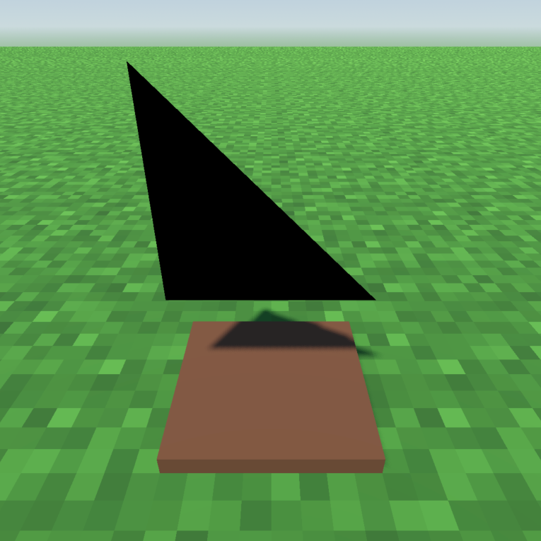

# Transparency-Based 4D Visualization in Virtual Reality

By: Jacob Malin

  
  
  
  

https://github.com/JacobMalin/4d-visualization/assets/34765120/922eb609-da6f-446e-b460-73968d32e45f

A system to visualize 4D shapes using VR. Uses transparency to indicate distance from the viewing space, where objects up to 1 meter away from the viewing space are visible in a semi-transparent state. The viewing space may also be rotated to capture different views of the 4D shapes.

## Tiny's Table

A one-dimension-reduced model, in which a 2D character, named Tiny, is placed within a 3D body. Rather than a viewing space, Tiny can manipulate a viewing plane and rotate it to view 3D objects.

https://github.com/JacobMalin/4d-visualization/assets/34765120/227780f5-b895-4d2b-9115-4c47ff98be15

  
  
  
  

  
  

## The 4D Visualization

https://github.com/JacobMalin/4d-visualization/assets/34765120/df86df5a-997d-4fb6-9f9d-45f932d97d09

  
  
  
  

  
  
  
  
  
  

  
  
  
  

## Run

Executable is hypercube.exe, or the project can be downloaded and then built in Godot v4.2.1.

This project is built for the Meta Quest 2 and may not work on other devices.

## Paper

More details can be found in the paper: [Transparency-Based 4D Visualization in Virtual Reality](https://github.umn.edu/malin146/csci-8980-project/blob/main/Transparency-Based%204D%20Visualization%20in%20Virtual%20Reality.pdf)
