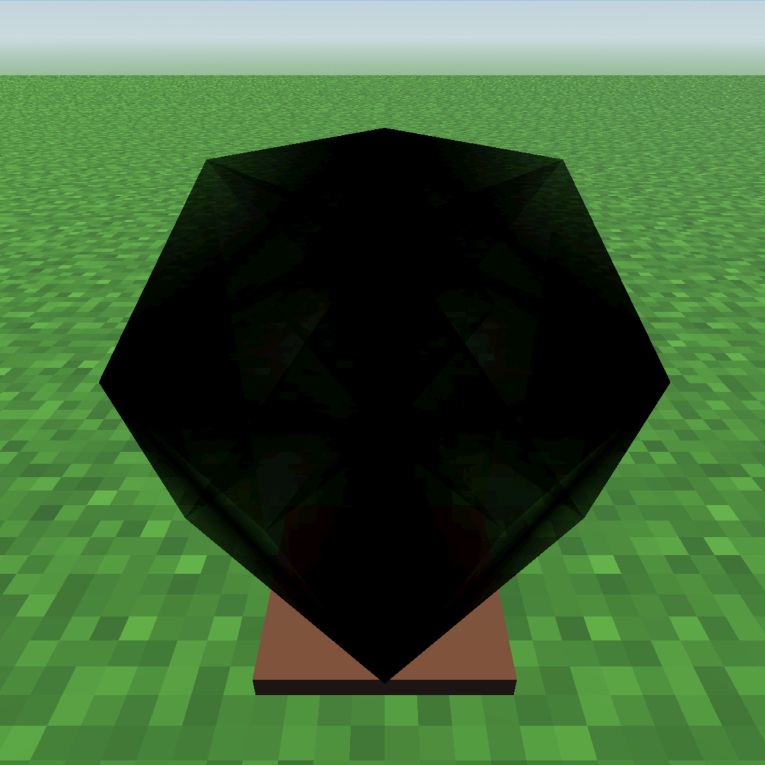

# Transparency-Based 4D Visualization in Virtual Reality

By: Jacob Malin

4D visualization in virtual reality.

## Run

Executable is hypercube.exe, or the project can be downloaded and then built in Godot v4.2.1.

This project is built for the Meta Quest 2 and may not work on other devices.

## Paper

[Transparency-Based 4D Visualization in Virtual Reality](https://github.umn.edu/malin146/csci-8980-project/blob/main/Transparency-Based%204D%20Visualization%20in%20Virtual%20Reality.pdf)
